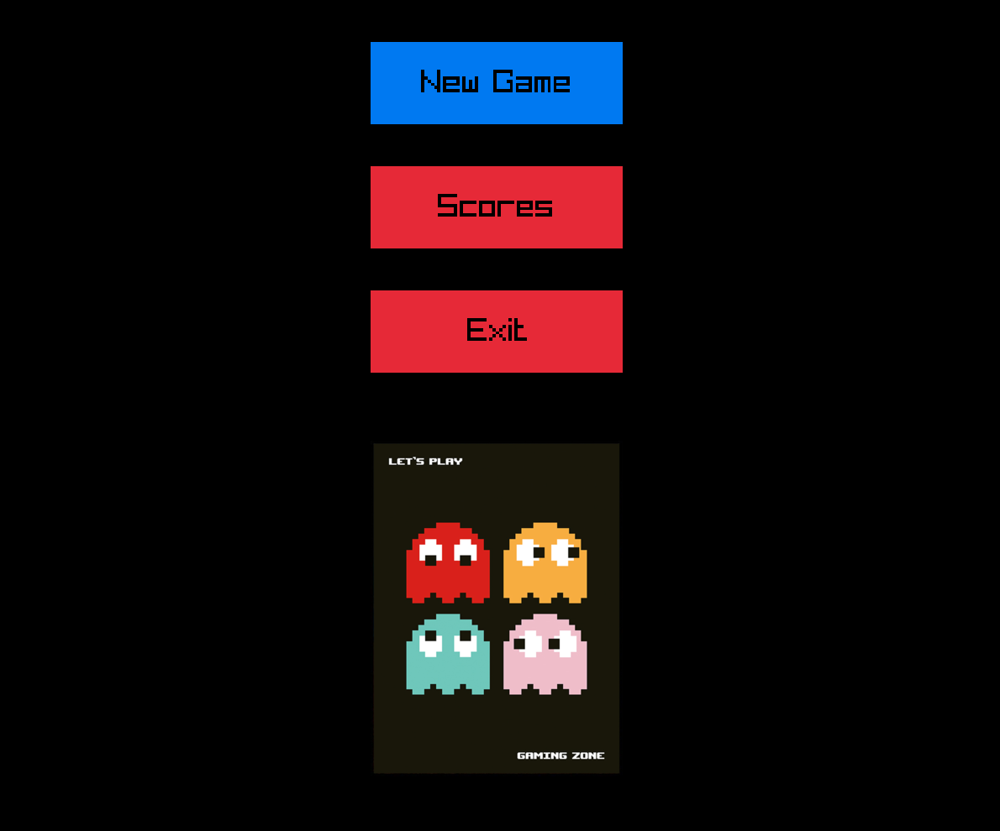
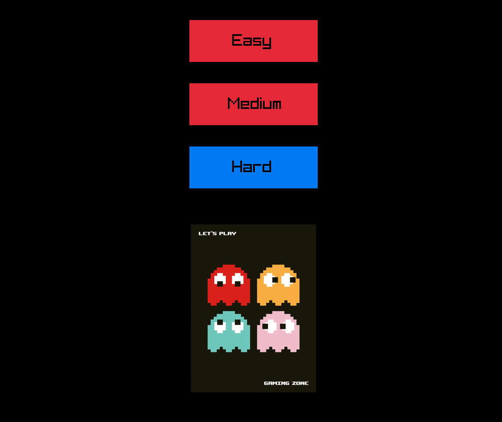
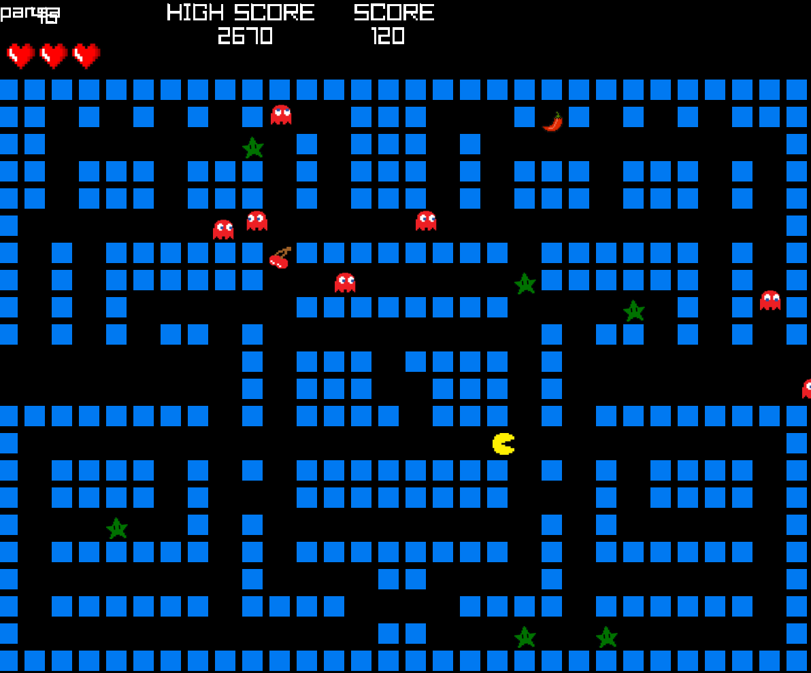
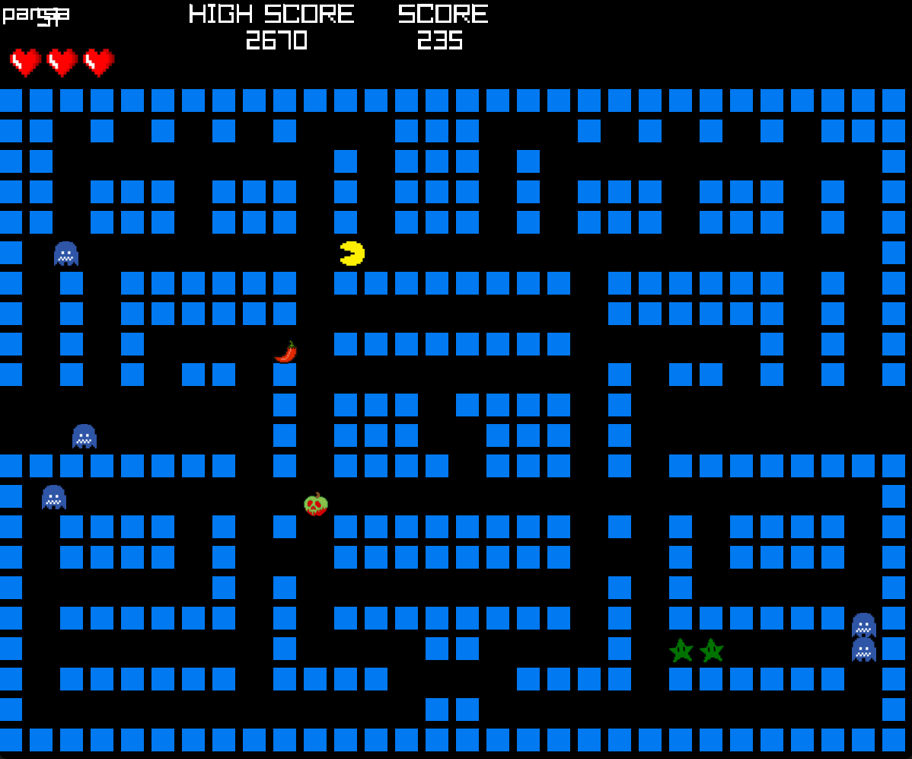

# 🟡 Pac-Man Game in C (Raylib UI)

A fun and challenging Pac-Man clone written in **C** with a graphical user interface built using **Raylib**.  
Navigate the maze, avoid ghosts, collect stars, and try to beat your high score!

---

## 🎮 Game Overview

This is a **graphical Pac-Man game** featuring smooth gameplay powered by Raylib.  
Players choose from three difficulty levels, where ghost count and speed increase. The goal is to survive and collect as many stars as possible before being caught by a ghost.

---

## 🧠 Game Mechanics

- 🎯 **Objective**: Collect stars ⭐ and avoid ghosts 👻 for as long as possible.  
- 💀 **Lose Condition**: Colliding with a ghost ends the game.  
- 🔄 **No winning condition** — the game continues indefinitely until you lose.  
- 📈 **High Score**: Tracks and saves your highest score across sessions.

---

## 🗂️ Levels

| Level   | Ghosts | Ghost Speed | Star Score | Difficulty     |
|---------|--------|-------------|------------|----------------|
| Easy    | 1      | Slow        | Low        | Beginner       |
| Medium  | 2      | Medium      | Medium     | Intermediate   |
| Hard    | 3      | Fast        | High       | Challenging    |

---

## 🚀 Features

- 🎨 Graphical UI built with **Raylib**  
- 👻 Multiple ghosts with increasing speed and difficulty  
- ⭐ Star collection and dynamic scoring system  
- 🎮 Three difficulty levels (Easy, Medium, Hard)  
- 📊 Persistent high score saved to a file  
- ⌨️ Smooth keyboard controls (arrow keys)  
- 🔄 Endless gameplay until the player loses
---

## 📸 Screenshots

Here are some in-game screenshots:

### 🟡 Gameplay Preview

